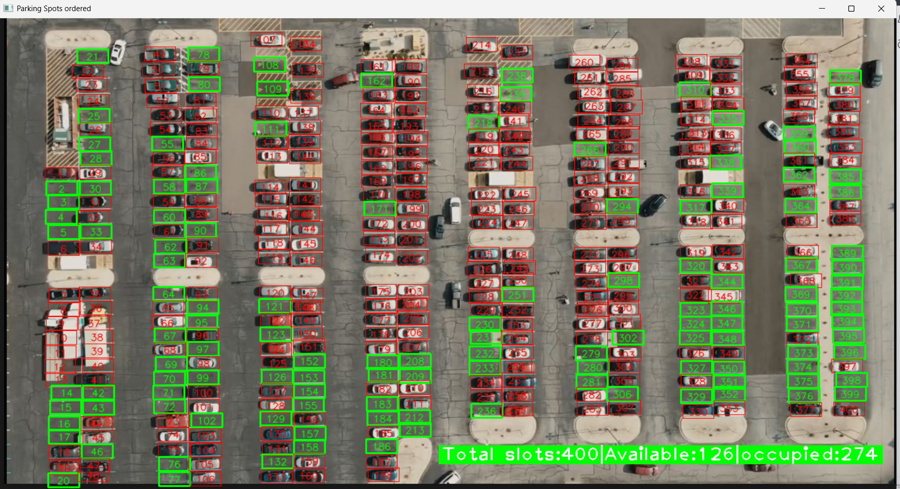
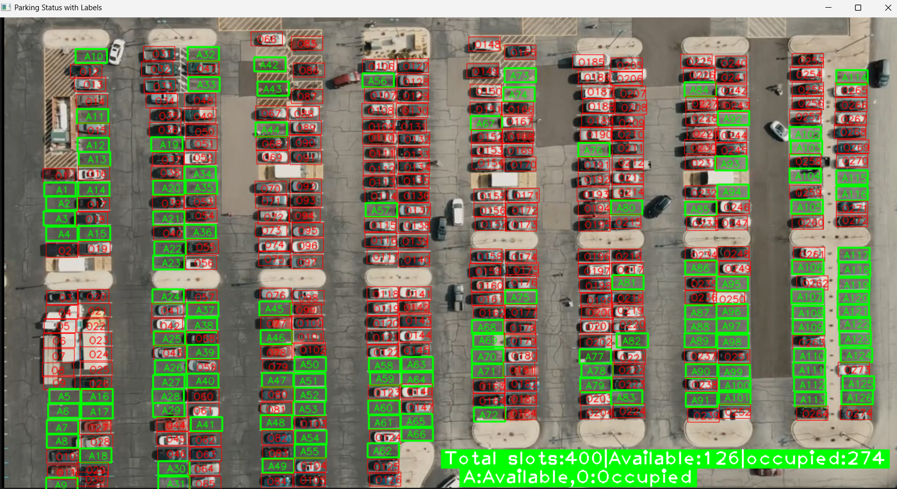

# Parking Slot Detection System

This project provides a simple yet effective solution for detecting and classifying parking spaces as **available** or **occupied** using image processing with OpenCV.

## Features

- Manual selection of parking spots using mouse clicks  
- Detection of parking space occupancy based on pixel analysis  
- Visual output with labeled slots (Available/Occupied)  
- Automatic Excel report generation summarizing slot usage  

## File Structure

```
ParkingSpaceCounter/
│
├── carParking1/
│   └── P2.png
|── images/
│   |── Parking Spots ordered.png
│   └── Parking status with Labels.png
├── output1/
│   ├── parking_Slot_Details.xlsx
│   └── Parking_Summary.xlsx
├── parkingspacepicker.py
├── main.py
├── CarParkPos
├── requirements.txt
└── README.md
```

## How It Works

### 1. Mark Parking Slots

```bash
python parkingspacepicker.py
```

- Left-click to **add** parking spots  
- Right-click to **remove** a spot  
- Saves slot positions to `CarParkPos` file  

### 2. Run Detection

```bash
python main.py
```

- Applies image processing  
- Detects availability based on pixel thresholds  
- Displays real-time output with labels  
- Saves Excel reports  

## Installation

```bash
pip install -r requirements.txt
```

## Requirements

- Python 3.6+  
- OpenCV  
- Numpy  
- Pandas  
- CvZone  
- OpenPyXL  

## Output Example

Two output windows:
- **Parking Spots ordered** – 
- **Parking Status with Labels** – 


 